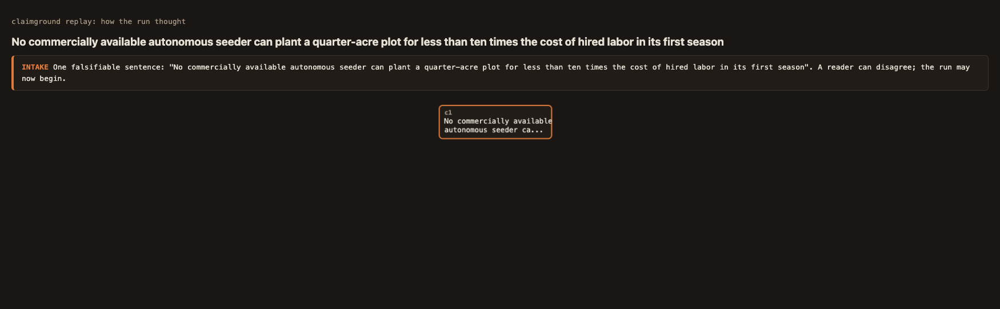
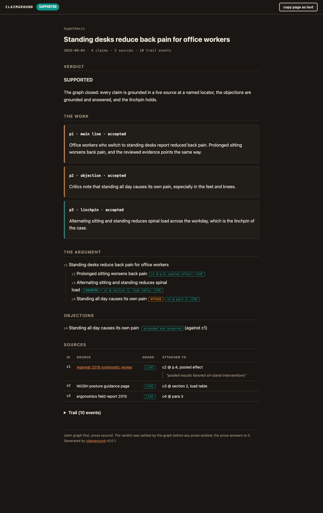
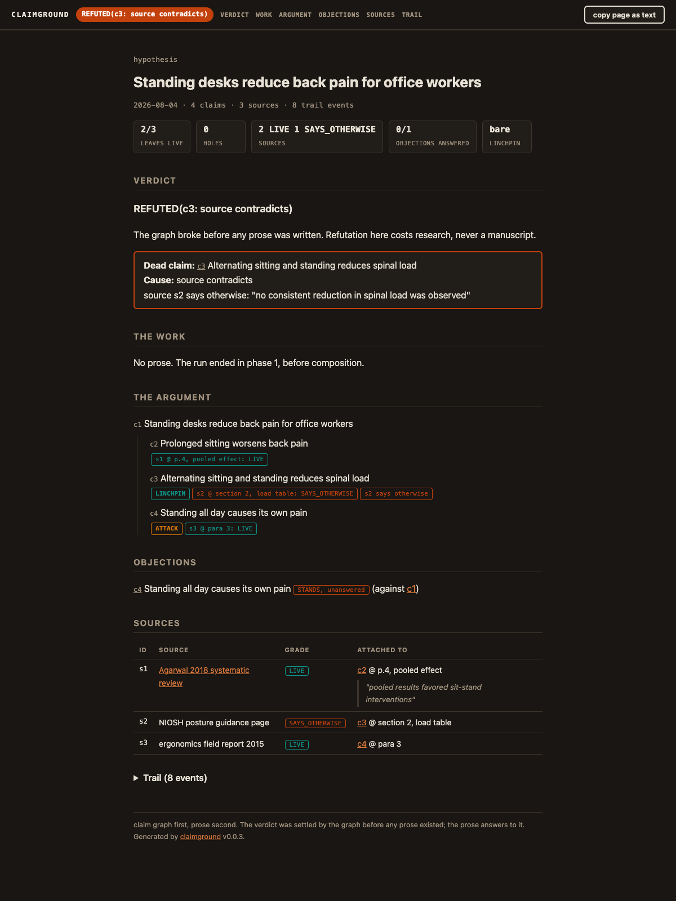

# claimground

**Claim graph first, prose second.** v0.0.1

claimground builds the burden of proof behind one falsifiable sentence.
It refuses topics, decomposes the claim into what it needs and what attacks
it, grounds every leaf in a real source at a named locator, and only then
(if the graph closes) lets prose be written. Every sentence of the prose is
extracted and mapped back to a graph node; anything unmapped gets cut or
grounded first.

Refutation can only happen in phase 1, before any prose exists. A dead
claim costs research, never a manuscript. REFUTED is a terminal success
state with a documented cause of death.

## The two phases

```text
PHASE 1: GRAPH                          PHASE 2: COMPOSE
intake -> decompose -> ground           plan -> fill -> check
   |         |           |                |      |       |
one       needs +     source @         passages prose  extract
sentence  attacks     locator,         (objections and  + map to
that a    (attacks    graded LIVE /    linchpin ship    graph, word
reader    grounded    DEAD /           with the work)   bands, banned
could     too)        SAYS_OTHERWISE                    strings
disagree
with            try_close: CLOSED | OPEN | BROKEN
                BROKEN -> REFUTED(cause). Run ends. No prose.
```

Verdicts: `SUPPORTED | REFUTED(cause) | UNDECIDED`. The verdict is settled
by the graph, never by the prose.

## Watch a run think



Every report embeds this replay live (the "replay the run" button in The
Argument section, or the "watch how the run got here" link under the
verdict). `replay` exports it as a standalone page; `gif` exports the
animation above.

## Two real runs, same evidence, opposite claims

[examples/robot-cost-gap/](examples/robot-cost-gap/) is the inverse of the
run below, and it reached **SUPPORTED**
([live page](https://raw.githack.com/ctavolazzi/claimground/main/examples/robot-cost-gap/report.html)):
*"No commercially available autonomous seeder can plant a quarter-acre
plot for less than ten times the cost of hired labor in its first
season."* Same cached evidence base, one new source (FarmBot's own ROI
page, which testifies for the objection at one locator and for the
linchpin at another), full phase-2 pipeline: passages planned, prose
composed, every sentence mapped back to the graph, receipts rendered
inline with grades and dates. The pair is the point: the verdicts fall
out of the graph, not the author's mood.

## A real run

[examples/johnny-autoseed-cost/](examples/johnny-autoseed-cost/) is the
first run on a real claim with real research: *"An autonomous seeding
robot plants a quarter-acre plot at lower cost per bed than hired labor
within one season."* Verdict: **REFUTED(c6: ungroundable)**, reached
before any prose existed. The linchpin (robot cost per bed beats labor
cost per bed) could not be grounded, and the grounded numbers imply its
opposite by roughly two orders of magnitude: $7,995 of robot covering
about 4 beds versus labor at $17.15/hr median. The run directory carries
the full chain of custody: `state.json` (graph, dated grades including a
WALLED grade for the robot-blocked BLS page, work-across trail),
`report.html` ([live page](https://raw.githack.com/ctavolazzi/claimground/main/examples/johnny-autoseed-cost/report.html)),
and `cache/` with the raw HTML of every source read, quotes verified
present in the cached bytes.

## What a run looks like

Both reports below come from the same worked example (the standing-desk
hypothesis in `examples/`). The only difference between them is one grade:
in the second run, fetching the NIOSH source revealed it says the opposite
of the linchpin claim, so the graph broke and the run ended before any
prose existed.

**SUPPORTED** ([live page](https://raw.githack.com/ctavolazzi/claimground/main/examples/report.html) ·
[examples/report.html](examples/report.html), built from
[examples/state.json](examples/state.json)). The graph closed: prose was
written, checked back against the graph, and shipped with its objection
passage. The top-right button copies the entire report as clean plain text.



**REFUTED** ([live page](https://raw.githack.com/ctavolazzi/claimground/main/examples/report-refuted.html) ·
[examples/report-refuted.html](examples/report-refuted.html), built from
[examples/state-refuted.json](examples/state-refuted.json)). One source
graded SAYS_OTHERWISE against the linchpin. Note the dead-claim ledger
with the contradicting quote, the SAYS_OTHERWISE badges in the tree and
sources table, and the objection now standing unanswered. No prose was
ever written; the report itself is the deliverable.



## Files

- `claimground_lib.py` : the engine. Pure append-only LOGIC layer, a small
  CLI over a `state.json` file, and a renderer that emits a self-contained
  scannable HTML report with a copy-page-as-text button. Stdlib only.
- `prototype/` : the throwaway interactive terminal prototype the engine
  grew from, kept for provenance. Its question: does the two-phase model
  feel right when driven by hand?
- `skill/SKILL.md` : the Claude Code skill (`/claimground`) that drives the
  engine: it does the research (real web sources, exact locators, honest
  grading including SAYS_OTHERWISE against its own case), the engine does
  the bookkeeping. Install by copying to `~/.claude/skills/claimground/`.
- `examples/` : a worked run.

## CLI

```bash
python3 claimground_lib.py validate  state.json
python3 claimground_lib.py close     state.json [--record]
python3 claimground_lib.py plan      state.json [--apply]
python3 claimground_lib.py fill      state.json <spec_id> <prose.txt>
python3 claimground_lib.py check     state.json <spec_id> [--accept]
python3 claimground_lib.py verdict   state.json
python3 claimground_lib.py render    state.json <out.html>
```

The state schema is documented in the lib docstring. All writes are
appends; latest record wins; the trail is the audit log.

## Design lineage

ACH (Heuer) supplies the ground discipline: evidence is tested against
every claim it touches, attacks included, and one small judgment per
interaction (every ACH tool that batched judgments died of overload).
Argument mapping (Argdown and kin) supplies the graph shape. The
extract-and-map check runs fact-checking forward: instead of tracing
published claims back to sources, no claim gets published without a
source already attached.
